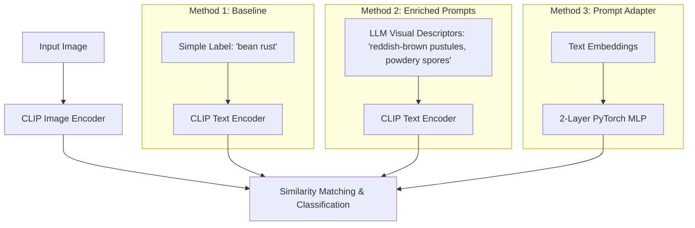

# CLIP-Prompt-Enhancement: Fine-Grained Zero-Shot Evaluation (Frozen CLIP)

[](https://www.python.org/)
[](https://pytorch.org/)
[](https://huggingface.co/)

**Note on Core Methodology:** The pre-trained CLIP model's weights (`openai/clip-vit-base-patch32`) remain completely **frozen** throughout this project. Instead of fine-tuning the base model's visual or textual representations, this pipeline evaluates two lightweight, post-hoc enhancement strategies for zero-shot classification:
1. **LLM-Guided Prompt Enrichment**: Expanding simple labels with detailed visual descriptors.
2. **Lightweight Prompt Adapter**: Training a 2-layer PyTorch MLP classifier directly on frozen CLIP text embeddings.

Empirical results show that performance gains are highly **mixed and dataset-dependent**, highlighting clear trade-offs between zero-shot generalization and semantic feature overlap in fine-grained tasks.


---

## 📈 Key Results (Beans Dataset)

Evaluated on the Hugging Face Beans dataset (`AI-Lab-Makerere/beans`) containing test images across three categories: `angular leaf spot`, `bean rust`, and `healthy`.

| Method | Top-1 Accuracy (%) | Top-5 Accuracy (%) | Overall Delta vs. Baseline |
| :--- | :---: | :---: | :---: |
| **Baseline CLIP** | 30.83% | 100.0% | *Baseline* |
| **Enriched Prompts** | 32.50% | 100.0% | **+1.67%** |
| **Prompt Adapter (MLP)** | **39.17%** | 100.0% | **+8.34%** |

### Per-Class Accuracy Breakdown
* **angular leaf spot**: Baseline **87.18%** ➔ Enriched **28.21%** ➔ Adapter **0.00%**
* **bean rust**: Baseline **7.50%** ➔ Enriched **65.00%** ➔ Adapter **17.50%**
* **healthy**: Baseline **0.00%** ➔ Enriched **4.88%** ➔ Adapter **97.56%**

---

## 💡 How It Works



1. **Baseline CLIP**: Uses standard prompts like `a photo of a {class_name}`.
2. **LLM Prompt Enrichment**: Replaces generic labels with structured visual descriptions (color, texture, shapes, lesions) to construct rich text prototypes.
3. **Prompt Adapter**: A lightweight PyTorch MLP trained on top of CLIP text embeddings to map text prototypes directly to target classes, optimizing fine-grained distinctions.

---

## 🛠️ Setup & Installation

All pipelines are CPU-compatible and do not require GPU hardware.

```bash
# Clone the repository
git clone https://github.com/Kalyansai1844/FineTuneCLIP.git
cd FineTuneCLIP

# Create and activate virtual environment
python -m venv .venv
# On Windows:
.venv\Scripts\activate
# On macOS/Linux:
source .venv/bin/activate

# Install dependencies
pip install -r requirements.txt
```

---

## 🚀 Quick Start (Offline Smoke Test)

Verify the pipeline end-to-end in less than 30 seconds using a tiny synthetic dataset and a deterministic model stub (no internet or API keys required):

```bash
# 1. Generate synthetic dataset metadata
python data_loader.py --dataset smoke --num-classes 3 --train-limit 6 --test-limit 6 --metadata-out results/dataset_metadata.json

# 2. Run baseline CLIP stub
python baseline_clip.py --dataset smoke --model smoke --num-classes 3 --test-limit 6 --batch-size 2 --out results/baseline.json

# 3. Generate fallback offline prompts
python prompt_generator.py --dataset smoke --provider fallback --num-classes 3 --out results/generated_prompts.json

# 4. Run enriched CLIP stub
python enriched_clip.py --dataset smoke --model smoke --prompts results/generated_prompts.json --num-classes 3 --test-limit 6 --batch-size 2 --out results/enriched.json

# 5. Train & evaluate prompt adapter stub
python prompt_adapter.py --dataset smoke --model smoke --prompts results/generated_prompts.json --num-classes 3 --test-limit 6 --batch-size 2 --epochs 5 --checkpoint results/prompt_adapter.pt --out results/adapter.json

# 6. Generate comparative reports & plots
python evaluate.py --baseline results/baseline.json --enriched results/enriched.json --adapter results/adapter.json --csv comparison.csv --plot per_class_accuracy.png
```

---

## 📊 Running Real-Data Experiments (Beans Dataset)

Run the full pipeline on the `AI-Lab-Makerere/beans` dataset using the pre-trained `openai/clip-vit-base-patch32` model.

### 1. Prepare Dataset & Prompts
```bash
# Prepare metadata
python data_loader.py --dataset AI-Lab-Makerere/beans --num-classes 3 --train-limit 100 --test-limit 120 --metadata-out results_beans/real_dataset_metadata.json

# Generate class descriptors (using fallback rule-based generator)
python prompt_generator.py --dataset AI-Lab-Makerere/beans --provider fallback --num-classes 3 --out results_beans/real_prompts.json
```
*(Optional: Set `OPENAI_API_KEY` and run with `--provider openai` for GPT-guided prompt generation).*

### 2. Run Evaluations & Training
```bash
# Baseline CLIP
python baseline_clip.py --dataset AI-Lab-Makerere/beans --model openai/clip-vit-base-patch32 --num-classes 3 --test-limit 120 --batch-size 16 --out results_beans/real_baseline.json

# Enriched CLIP
python enriched_clip.py --dataset AI-Lab-Makerere/beans --model openai/clip-vit-base-patch32 --prompts results_beans/real_prompts.json --num-classes 3 --test-limit 120 --batch-size 16 --out results_beans/real_enriched.json

# Prompt Adapter (PyTorch Training)
python prompt_adapter.py --dataset AI-Lab-Makerere/beans --model openai/clip-vit-base-patch32 --prompts results_beans/real_prompts.json --num-classes 3 --train-limit 100 --test-limit 120 --batch-size 16 --epochs 50 --checkpoint results_beans/real_prompt_adapter.pt --out results_beans/real_adapter.json
```

### 3. Generate Comparative Reports
```bash
python evaluate.py --baseline results_beans/real_baseline.json --enriched results_beans/real_enriched.json --adapter results_beans/real_adapter.json --csv comparison.csv --plot per_class_accuracy.png
```

---

## 📂 Project Structure

* `data_loader.py`: Streamlines dataset fetching, splits, and metadata serialization.
* `baseline_clip.py`: Standard zero-shot CLIP classifier.
* `prompt_generator.py`: Generates descriptive visual prompts (supports OpenAI, Ollama, and Fallback rule-based engines).
* `enriched_clip.py`: Evaluates zero-shot CLIP using averaged visual description prototype embeddings.
* `prompt_adapter.py`: Two-layer PyTorch MLP mapping text embeddings to target classes.
* `evaluate.py`: Generates `comparison.csv` and compiles `per_class_accuracy.png` charts.
* `clip_utils.py`: Shared utilities (image processing, text encoding, logging, and metrics).
* `app.py`: Interactive Gradio web interface comparing the models in real-time.

---

## 🧠 Key Insights, Limitations & Trade-offs

* **Backbone Architecture is Completely Frozen**:
  The CLIP vision and text backbones (`openai/clip-vit-base-patch32`) are kept **frozen**. No weights of the multi-modal transformer were modified. All learning is restricted to a small post-hoc prompt adapter MLP on top of frozen embeddings.

* **Highly Mixed and Class-Dependent Results**:
  Prompt optimization and post-hoc classification are not silver bullets for fine-grained classification. On the Beans dataset:
  - **Prompt Enrichment** drastically improved the poorly-performing `bean rust` class (**+57.5% absolute gain**) by supplying diagnostic visual terms. However, the exact same descriptive terminology introduced visual overlap with `angular leaf spot` features (both contain "brown spots" and "lesions"), causing a catastrophic **-59.0% drop** in that class.
  - **The Prompt Adapter** achieved the highest overall Top-1 accuracy (**39.17%**), but did so through representation collapse—effectively acting as a majority-class classifier by predicting the `healthy` class with **97.6%** accuracy while scoring **0.0%** on `angular leaf spot`.

* **Key Engineering Takeaways for Portfolios**:
  - **Discriminative vs. Descriptive**: Prompts generated by LLMs must be explicitly engineered to be *discriminative* (mutually exclusive) between target classes, rather than just *descriptive* of a single class in isolation.
  - **Loss Regularization**: Lightweight prompt adapters trained on small fine-grained subsets require class-balanced loss functions (like focal loss or cost-sensitive weights) and stronger regularization to prevent collapse onto the dominant majority class.


---

## 🚀 Interactive Demo

Launch the local Gradio interface to upload custom leaf images and inspect classifications side-by-side:

```bash
python app.py --dataset AI-Lab-Makerere/beans --model openai/clip-vit-base-patch32 --num-classes 3
```

---

## 📄 Deliverables in Root

* `comparison.csv`: Tabular comparison of baseline, enriched, and adapter classification results.
* `per_class_accuracy.png`: Visualization of per-class performance differentials.
* `results_summary.md`: Comprehensive design verification and empirical research report.
* `project_summary.md`: Concise resume-ready talking points and interview context.
